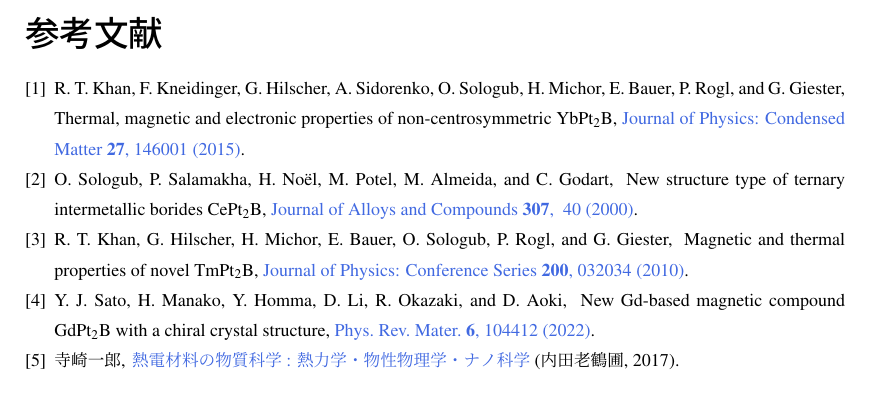

# REVTeX-ja

「REVTeX-ja」は、アメリカ物理学会（APS）が配布しているTeXのスタイルをまねて作成した、和文のTeX文書で扱えるBibTeXスタイルファイル（.bst）です。

また、「hyperref」パッケージと組み合わせることで、雑誌名にリンクを付けることができます。

 以下のような参考文献が自動で生成されます。欧文／和文の両方に対応します。


サンプル用のTeX文書を用意しました。
一式をダウンロード・解凍したのちに、``sample.tex``をコンパイルしてください。


# 導入方法

- 「REVTeX-ja.bst」をダウンロードし、TeXが認識できる箇所に置く。
  - `REVTeX-ja.bst`を使いまわしたい場合は、`C:\texlive\texmf-local\bibtex\bst`がよい。
  - あるいは、目的の`.tex`の置いてある場所に一緒に置く。
- 必要に応じて、コマンドプロンプトで`mktexlsr`を叩く。

# 使い方

- `.tex`のあるところに`*.bib`というテキストファイルを作る（*は`ref`などの好きな名前）。
- 各文献のサイトから拾った文献情報をコピペする。
- TeX文書上で、参考文献のリスト（上画像）を出力したい場所に以下を書く。
    ```latex
    \bibliographystyle{REVTeX-ja}   % *.bstファイルの名前
	\bibliography{ref}  % *.bibファイルの名前
    ```
- 文中で引用したい箇所に`\cite`コマンドで文献キーを書く。


# 特徴

## article形式
- 形式は、「著者, タイトル, 雑誌名 **巻**, 最初のページ数 (年).」です。
- 著者のファーストネームはイニシャルになります。
- ページ数は、形式を揃えるため最初のページのみ出力します。

## book形式
- 形式は、「著者, タイトル (出版社, 出版都市, 出版年), シリーズ, 巻, 版, ページ数. 」です。
- 出版都市、シリーズ、巻、版、ページ数は省略可。
  

## ウェブサイト
- 形式は、「著者, サイトタイトル, 公開年, 閲覧日.」の順です。
- タイトル以外はすべて省略可能です（が、author、url、およびurldateは最低限書くべきです）。
- @misc形式で
  ```latex
    @misc{key,
      title = {Website Title},
      author = {Author Name},
      year = {Year Published},
      url = {http://url.jp},
      urldate = {Accessed on Month Day, Year}
    }
  ```
  としてください。

## それ以外
- まだ対応できていません…。
- 要望があれば対応させます。


# 更新履歴

### 25/01/21 (version 3.141592653)
- andの前のカンマを修正。
- いくつかの書式でタイトルが斜体になる不具合を修正。

### 24/12/15 (version 3.14159265)
- webサイトの引用形式を修正。


### 24/11/23 (version 3.1415926)
- webサイトの引用に対応。
- サンプル文書追加。

### 24/10/22 (version 3.141592)
- URLつき/URLなしを統合。hyperrefパッケージの有無だけで対応できるように。
- 統合による大幅アップデートに伴い、bstの名称も変更。
- ページ番号の出力を調整。


### 24/08/19 (version 3.14159)
- ハイパーリンク部分を大幅に修正。より簡素な書き方に。
- そのほか軽微な修正。


### 23/04/26 (version 3.1415)
- ハイパーリンクの位置がタイトルになってしまう問題を修正。


### 22/12/12 (version 3.141)
- カンマの入る位置を修正。
- 細かなバグ修正。


### 22/12/10 (version 3.14)
- ハイパーリンク付きに対応。
- そのほか細かなバグ修正。


### 22/11/28 (version 3.1)
- book形式の出力における軽微なバグ修正。


### 22/11/26 (version 3)
- 公開。
